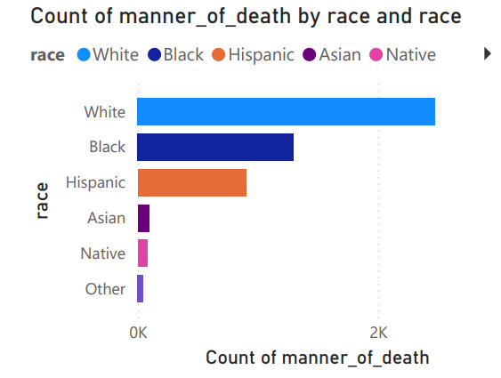
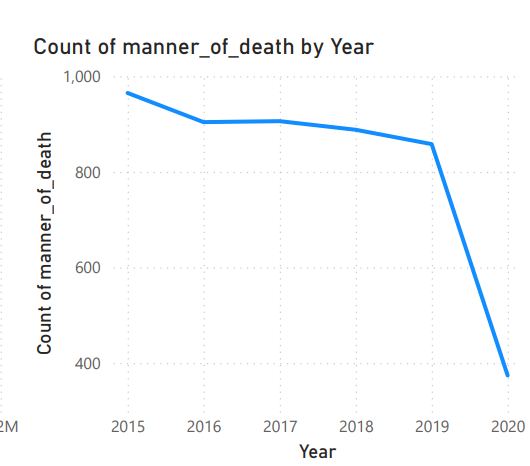
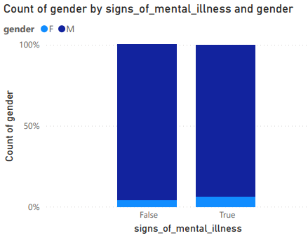
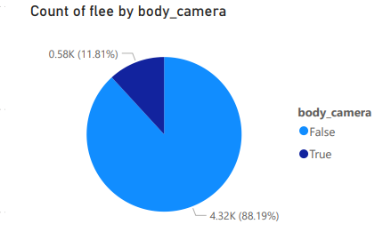
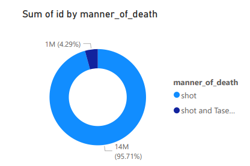

# PowerBI-Analysis-of-US-Police-Shootings

# Tittle: US Police Shootings

# Table of contents

- [Objective](#objective)
- [Stages](#stages)
- [Data cleaning](#data-cleaning)
- [Visualization](#visualization)
- [Analysis](#analysis)
 - [Findings](#findings)
 - [Discovery](#discovery)
- [Recommendations](#recommendations)
- [Conclusion](#conclusion)

# Objective

- What is the key main point?

This analysis aims to explore recent US police killings, a hot topic that came into being, "Racism". This data has been gathered to take out some insights and analyze the story around racism in America.  The dataset contains basic data about people like their name, age, gender, and race. 

Along with it, is the shooting/killing information, like the date of the event, where it happened? How they were shot? Did they attack? Were they holding weapons? Did they show any mental illness? Was the policeman wearing a camera? was the incident recorded? Did the suspect flee? Apart from that, a category column of which weapons were used by the suspect.

- What is the ideal solution?

To create a dashboard that provides insights into the analysis.

# Stages

- Download the .pbix file together with the dataset from this repository.
- Open the file in Power BI Desktop.
- (Optional) If using a different data source, connect your data to the existing model using Power Query Editor.
- Explore the report pages to gain insights into police shootings.
- 
# Data cleaning

- What do we expect the clean data to look like?
- What should it contain?
- What limitations should we apply to it?

The aim is to refine our dataset to ensure it is structured and ready for analysis.

The cleaned data should meet the following criteria and constraints:

- Only relevant columns should be retained.
- All data types should be appropriate for the contents of each column.
- No column should contain null values, indicating complete data for all records.

# Visualization

## Results
- What does the dashboard look like?
  

# Analysis

## Findings
- What did we find?
For this analysis, we’re going to focus on the questions below to get the information we need for the analysis.

Here are the key questions we need to answer:

- What is the distribution of incidents by race?
- What are the trends or patterns of shooting over a period of years?
- What is the correlation between gender and mental illness?
- Is there a correlation between recorded incidents and the number of those who flee under the incidents?
- What method of killing was used more during the incident?

### 1. What is the distribution of incidents by race?

### 2. What are the trends or patterns of shooting over a period of years?

### 3. What is the correlation between gender and mental illness?

### 4. Is there a correlation between recorded incidents and the number of those who flee under the incidents?

### 5. What method of killing was used more during the incident?

# Discovery

- What did we learn?

We discovered that

1. With the distribution of incidents by race, it was found that the race with the highest distribution of incidents was the white race with a manner of death (shooting or tasered) of about 2476, followed by Black, Hispanic, Asian, Native, and Others with the lowest incidents of about 48.
  
2. Upon analyzing the dataset, the trends or patterns of shooting over a period of years, indicated a highest spike in the year 2015 as more incidents were recorded in that year with a count of 965, and the lowest year was 2020 with a count of 374.
   
3. According to the findings, the relationship between gender and mental illness indicates that when mental illness was false, males had a percentage of about 95.79 compared to females, who had a percentage of about 4.0, and when mental illness was true, males still had the highest number with 93.74% compared to females with 6.26%. In summary, we can conclude that, with regard to the incident, there were more males than females.
   
4. The pie chart in the power BI report shows the relationship between the body camera and the count of flee individuals. There is a noticeable fact that the count of flee was high, with a percentage of 88.19 when the body camera was false and 11.81% when the body camera was true. In summary, we can conclude that more individuals fled when the body camera was off compared to the individuals who fled when the body camera was on. This can indicate trust issues on the side of the policy.

5. With regard to the method of killing, we can conclude that shooting was used more in the incident with a percentage of 95.71, compared to shooting and tasering, which was 4.29%.

# Possible Correlation

1. Distribution by Race: The data indicates that the white race has the highest number of incidents, followed by Black and Hispanic individuals. This distribution raises important questions about the underlying factors contributing to these disparities, such as socioeconomic conditions, systemic racism, or law enforcement practices.

2. Trends Over Time: The significant spike in incidents in 2015 followed by a decline in 2020 suggests possible shifts in law enforcement policies, public awareness, or reporting practices. The year 2020, in particular, was marked by social unrest and movements like Black Lives Matter, which may have influenced these trends.

3. Gender and Mental Illness Correlation: The data shows that a higher percentage of males were involved in incidents regardless of mental illness status. This suggests that males are disproportionately represented in these incidents, possibly due to societal roles, behaviors, or law enforcement biases.

4. Recorded Incidents and Fleeing Suspects: The analysis indicates that suspects were more likely to flee when the body camera was off, suggesting potential trust issues between the public and law enforcement. The presence of body cameras may act as a deterrent to fleeing, reflecting concerns about accountability and transparency.

5. Method of Killing: The overwhelming use of shooting as the method of killing raises concerns about the proportionality and necessity of force used in these incidents. The limited use of tasering suggests a preference for lethal force in many situations.

# Recommendations
- What do you recommend based on the insights gathered?

1. Policy Reform: Given the racial disparities in the distribution of incidents, there should be a focused review of law enforcement practices to identify and address potential biases. This could involve revising use-of-force policies, increasing cultural competency training, and ensuring more equitable policing.

2. Mental Health Support: The data highlights the need for better mental health support and crisis intervention training for law enforcement officers. Since mental illness is a factor in many incidents, integrating mental health professionals into policing could help de-escalate situations and reduce the use of lethal force.

3. Body Camera Utilization: The correlation between fleeing suspects and the absence of body cameras underscores the importance of widespread body camera usage. Ensuring that all officers wear and activate body cameras during interactions with the public could enhance accountability and build trust within communities.

4. Non-Lethal Force Emphasis: The high percentage of shootings suggests that law enforcement should prioritize non-lethal methods, such as tasers or other less-lethal tools, especially in situations where the threat level does not warrant lethal force. Training programs should emphasize de-escalation techniques and alternatives to shooting.

5. Community Engagement: To address the underlying issues contributing to these incidents, law enforcement agencies should engage with communities, particularly those most affected, to build trust, improve relationships, and work collaboratively to create safer environments.

# Conclusion

Base on the findings and analysis of the US police killings dataset, we can conclude that the project reveals several key insights regarding the distribution of incidents by race, trends over time, and the correlation between gender, mental illness, and recorded incidents which showcases the effectiveness of exploratory data analysis in providing useful insights in the dataset.
