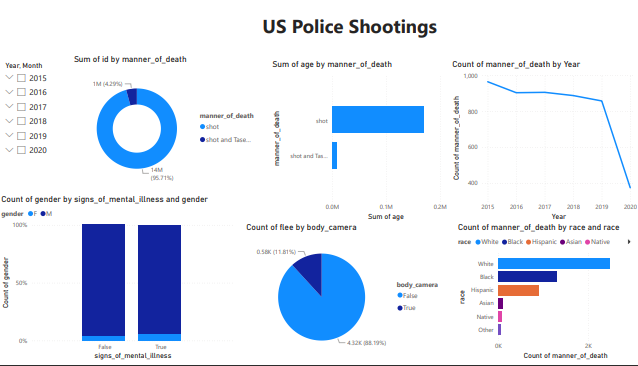

# PowerBI-Analysis-of-US-Police-Shootings

# Tittle: US Police Shootings

# Table of contents

- [Objective](#objective)
- [Stages](#stages)
- [Data cleaning](#data-cleaning)
- [Visualization](#visualization)
- [Analysis](#analysis)
 - [Findings](#findings)
 - [Discovery](#discovery)
- [Recommendations](#recommendations)
- [Conclusion](#conclusion)

# Objective

- What is the key main point?

This analysis aims to explore recent US police killings, a hot topic that came into being, "Racism". This data has been gathered to take out some insights and analyze the story around racism in America.  The dataset contains basic data about people like their name, age, gender, and race. 

Along with it, is the shooting/killing information, like the date of the event, where it happened? How they were shot? Did they attack? Were they holding weapons? Did they show any mental illness? Was the policeman wearing a camera? was the incident recorded? Did the suspect flee? Apart from that, a category column of which weapons were used by the suspect.

- What is the ideal solution?

To create a dashboard that provides insights into the analysis.

# Stages

- Download the .pbix file together with the dataset from this repository.
- Open the file in Power BI Desktop.
- (Optional) If using a different data source, connect your data to the existing model using Power Query Editor.
- Explore the report pages to gain insights into police shootings.
- 
# Data cleaning

- What do we expect the clean data to look like?
- What should it contain?
- What limitations should we apply to it?

The aim is to refine our dataset to ensure it is structured and ready for analysis.

The cleaned data should meet the following criteria and constraints:

- Only relevant columns should be retained.
- All data types should be appropriate for the contents of each column.
- No column should contain null values, indicating complete data for all records.

# Visualization

## Results
- What does the dashboard look like?
  

# Analysis

## Findings
- What did we find?
For this analysis, we’re going to focus on the questions below to get the information we need for the analysis.

Here are the key questions we need to answer:

- What is the distribution of incidents by race?
- What are the trends or patterns of shooting over a period of years?
- What is the correlation between gender and mental illness?
- Is there a correlation between recorded incidents and the number of those who flee under the incidents?
- What method of killing was used more during the incident?

### 1. Who are the top sales by country?

### 2. Top 5 customers by sales?

### 3. top sale over the years?

# Discovery

- What did we learn?

We discovered that
1. United State is the highest order sales by country, followed by Ireland, with United Kingdom being the last top sales by country.
2. Don Flintiff, Nealson Cuttler, Terri Farra, Brenn Dundredge and Allis are the top customers by sales.
3. 2021 was the year with the highest sales with a sum of **$13,766**, 2020 sales was **$12,118**, 2019 sales was a total of **$12,187**, and lastly 2022 which was the lowest sales with a sum of **$7,063**.

 # Recommendations

- What do you recommend based on the insights gathered?

1. United State is the highest top sales by country, therefore i recommend we take more orders from United State compared to other countries. 
2. With regards to the top customers by sales, it may be worth considering collaborating or give out special offers, as the potential of return on investments is significantly high in the longrun.
3. Regarding the coffee types, the findings suggest that since Libirical and Arabica had the highest sales over the years, with Arabica reaching $841 in 2021 and Libirical achieving a total of about $844 in 2022, we recommend that the coffee shop produce more of these to maximize sales. Additionally, considering the fluctuation in sales from 2019 to 2022, we suggest analyzing the year with the highest sales and identifying the factors that contributed to that success to apply them in future years.

# Conclusion

Base on the findings and analysis of the coffee sale dashcoard, we can conclude that the project showcases the effectiveness of exploratory data analysis in providing useful insights in dataset that involved the customers, products and the orders.

